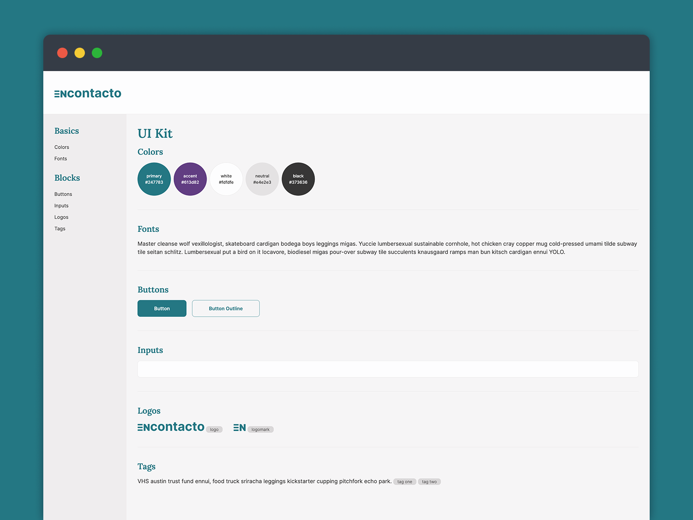

# encontacto

encontacto starter ui kit.


## Initial Install

```bash
npm install
```

note: this project was created with node 18.16.0 / npm 9.5.1.


## Start Development Server

```bash
npm start
```

this will open `localhost:20235/ui/index.html`


## Additional Resources

### Icons

- Phosphor Icons: [phosphoricons.com](https://phosphoricons.com/)


### Table Code (HTML + SASS/SCSS):

- Codepen: [codepen.io/mranenko/full/xxyeORY](https://codepen.io/mranenko/full/xxyeORY)


### Designs

- Dribbble: [dribbble.com/shots/20900904-encontacto-table-ui-kit](https://dribbble.com/shots/20900904-encontacto-table-ui-kit)
- Figma: [figma.com/file/h8TphAiz0O6VQFqZpqQSWo/encontacto?type=design&node-id=9%3A2&t=somspAqK20VhP14R-1](https://www.figma.com/file/h8TphAiz0O6VQFqZpqQSWo/encontacto?type=design&node-id=9%3A2&t=somspAqK20VhP14R-1)
