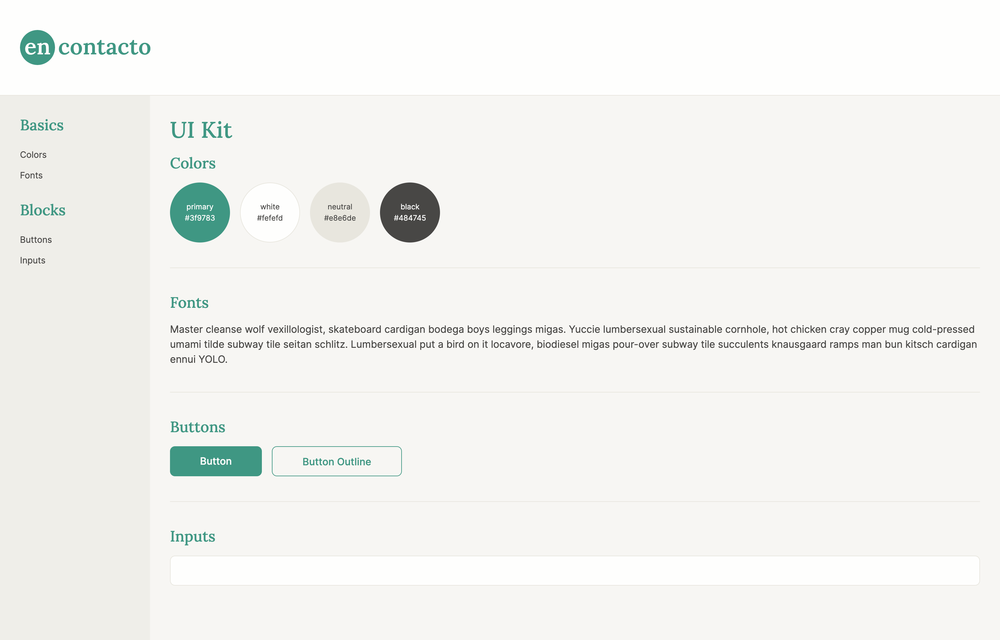

# encontacto

encontacto starter ui kit.


## Initial Install

```bash
npm install
```

note: this project was created with node 18.16.0 / npm 9.5.1.


## Start Development Server

```bash
npm start
```

this will open `localhost:20235/ui/index.html`
